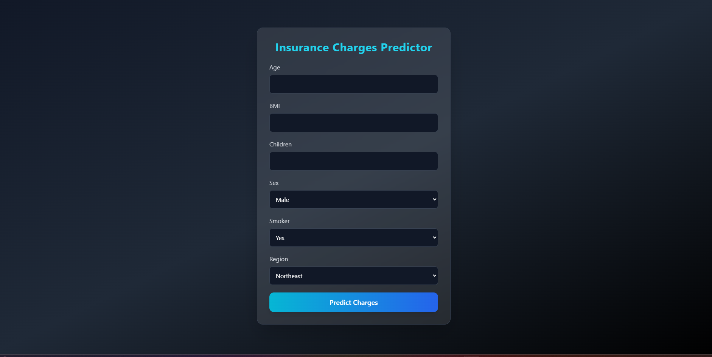

# 🏥 Insurance Charges Prediction App

This project predicts **medical insurance charges** based on personal details such as age, gender, BMI, number of children, smoking habits, and region.  
It uses a **Machine Learning model** trained on the `insurance.csv` dataset and provides a **Flask web app** interface for user input.

---

## 📂 Dataset
The dataset (`insurance.csv`) contains the following columns:

- `age` → Age of the individual  
- `sex` → Gender (`male` / `female`)  
- `bmi` → Body Mass Index  
- `children` → Number of children  
- `smoker` → Smoking status (`yes` / `no`)  
- `region` → Residential region (`northeast`, `northwest`, `southeast`, `southwest`)  
- `charges` → Medical insurance cost (Target variable)

---

## ⚙️ Tech Stack
- Python 3.12+
- Flask
- Pandas
- NumPy
- Scikit-learn
- HTML/CSS (for the frontend)

---

## 🚀 Features
✅ Train a regression model on `insurance.csv`  
✅ Flask app takes user input (Age, BMI, Children, Smoker, Region, etc.)  
✅ Predicts expected **insurance charges**  
✅ Simple web UI  

---

## 📦 Installation

Clone the repository:

```bash
git clone https://github.com/pythonicshariful/insurance-charge-predictor.git
cd insurance-charge-predictor
```

Create and activate a virtual environment:

```bash
python -m venv venv
source venv/bin/activate   # On Linux/Mac
venv\Scripts\activate      # On Windows
```

Install dependencies:

```bash
pip install -r requirements.txt
```

---

## ▶️ Usage

Run the Flask app:

```bash
python app.py
```

Open your browser and go to:

```
http://127.0.0.1:5000
```

Enter details like Age, BMI, Smoker, etc. → Get predicted charges 🎉  

---

## 📸 Example UI

---

## 🎥 Tutorial Video

[](https://youtu.be/eqWBtlbKYj0)


---

## 📊 Model Performance
- Algorithm used: `RandomForestRegressor` (or whichever you used)
- Evaluation metrics: RMSE, R² Score

---

## 🏷️ Tags
`#machine-learning` `#flask` `#insurance` `#regression` `#python` `#scikit-learn` `#ml-app`  

---

## 📜 License
This project is licensed under the MIT License.

---

👨‍💻 **Author:** [Shariful Islam](https://github.com/pythonicshariful)  
🚀 Happy Coding!
